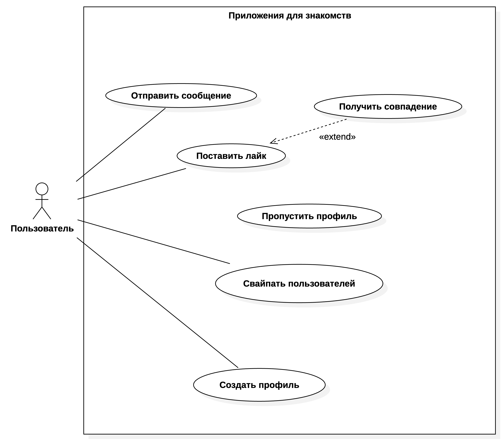

# Приложение для знакомств

# Требования к проекту
## 1.1 Максимальное количество пользователей, поддерживаемых в каждый момент времени
#### Ожидаемое количество одновременных сессий:
- До <b>10000</b> пользователей могут быть одновременно авторизованы и иметь активную сессию.
#### Количество полльзователей, активно взаимодействующих с приложением в реальном времени:
- До <b>1000</b> пользователей могут одновременно выполнять свайпы, отправлять/получать совпадения, загружать/обновлять профили.


## 1.2 Требуемая скорость обработки запросов
#### 1.2.1. Время отлика на запросы пользователей:
- Время обработки POST-запроса на свайп - не более 300 мс
- Время получения колоды - не более 200 мс
- Время получения профли - не более 150 мс

#### 1.2.2. Время обработки запросов на уровне БД и взаимодействие между сервисами:
- Запись свайпа в базу - < 50 мс
- Доступ к Redis для чтения/ записи колоды - < 20 мс
- Взаимодействие с RabbitMQ (отправка события совпадения) - < 10 мс

## 1.3. Объем хранимой информации
#### 1.3.1. Прогнозируемый объем данных на старте:
- <b>Профили:</b> ~10000 записей -> ~20 МБ
- <b>Свайпы:</b> ~100000 записей -> ~10-20 МБ
- <b>Колоды в Redis:</b> Хранятся на ~12 часов, общим объеймом до 50-100 МБ

#### 1.3.2. Прогнозируемый рост объема данных с течением времени:
<b>При росте пользователей до 1 млн:</b>
- Профили: до 200 МБ
- Свайпа до 2-5 ГБ
- Колоды в Redis: до 1-2 ГБ
Логи, телеграм-ссылки, изоьражения и другая информация могут добавить еще ~10-15 ГБ в течении года.

## Диаграмма прецедентов
<picture>
  
</picture>

## Архитектурная схема
<picture>
  
</picture>

## Grafana / Prometheus
#### Dashboard - Spring Boot 2.1 System Monitor
<picture>
    
</picture>


#### Dashboard - Cadvisor exporter
<picture>
    
</picture>


## Tsung

- Первый тест:
  - В течение 15 минут постепенно будет сгенерировано до 12000 пользователей, каждый из которых совершает свайпы.
- Второй тест:
  - В течение 1 минуты создаётся до 3000 пользователей с интенсивностью 1000 пользователей в секунду.
  
- Третий тест:
  - В течение 10 минут создаётся до 20000 пользователей, которые совершают свайпы.
  - Нагрузка распределена по фазам:
    - Фаза 1 (2 минуты):
      -	Пользователи приходят со скоростью 800 в секунду, максимум — 15000.
    - Фаза 2 (3 минуты):
      - Скорость возрастает до 1200 в секунду, максимум — 20000 пользователей.

1) 
   `````docker-compose up -d --build`````
2) 
   `````docker-compose exec tsung tsung -f /tsung/config/{config}.xml start`````
3) `````docker-compose run --rm -w "/root/.tsung/log/{date}/"  --entrypoint "/usr/local/lib/tsung/bin/tsung_stats.pl" tsung --stats "tsung.log"`````

#### Report - low_rate_high_users
<picture>
    
</picture>

#### Report - high_rate_low_users
<picture>
    
</picture>

#### Report - peak_load
<picture>
    
</picture>

# Вертикальное и горизонтальное масштабирование

<picture>
    
</picture>

<picture>
    
</picture>

<picture>
    
</picture>
